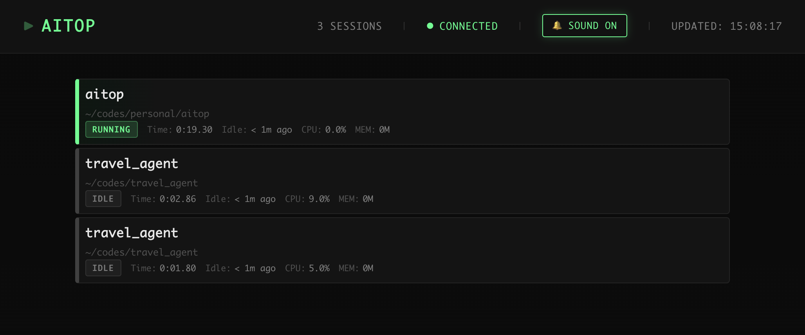

# aitop

<!-- [](https://www.npmjs.com/package/aitop) -->
[](https://opensource.org/licenses/MIT)
[](https://nodejs.org)
[](https://www.typescriptlang.org/)
[](https://github.com/wangyufeng0615/aitop/pulls)
[](https://github.com/wangyufeng0615/aitop/issues)
[](https://github.com/wangyufeng0615/aitop)



A simple web monitoring tool for AI coding assistants like Claude Code.

If you work with multiple Claude Code sessions, this tool helps you monitor their status and get finished notifications.

## Usage

```bash
git clone https://github.com/wangyufeng0615/aitop.git
cd aitop
npx aitop
```

aitop will run at port 8988 and open your browser. I usually move the browser tab to side screen.

**Please start aitop FIRST** before you open Claude Code, for full features.

Only support macos for now. Linux not tested yet.

## How it works

aitop monitors Claude Code session's status through three ways:

1. **Hook server** - Registers Claude Code hooks to POST events to aitop's local HTTP endpoint
2. **Log monitoring** - Watches `~/.claude/projects/../*.jsonl` for events
3. **PID tracking** - Tracks PIDs

Based on these methods, aitop determines whether each session is running, idle or closed. This multi-method is necessary for now and I tried my best.

## About Security

- **Log Reading**: aitop reads Claude Code logs from `~/.claude/` to detect specific keywords like "interrupted" for session status monitoring
- **Hook Registration**: aitop updates `~/.claude/settings.json` to add HTTP hook commands that POST JSON to `http://127.0.0.1:<port>/api/hooks/*` (no temporary files under home directory)
- **State**: Session state is kept in memory only; nothing is written to disk
- **Privacy**: aitop does not store any user information and has no internet connectivity features
- **Permissions**: Aside from updating `~/.claude/settings.json` to register hooks, aitop does not modify Claude Code files or require elevated privileges

## TODO

- **Dynamic port allocation** - Automatically find and use available ports instead of fixed port configuration
- **Multi-tool support** - Extend support beyond Claude Code to other AI coding assistants (Codex, Continue, Cursor, Codeium, etc.)
- **Auto-start capability** - Investigate feasibility of automatic aitop initialization when Claude Code sessions start, eliminating the need for manual pre-launch

## Contributing

Welcome for all kind of issues or pull requests.

## License

MIT
